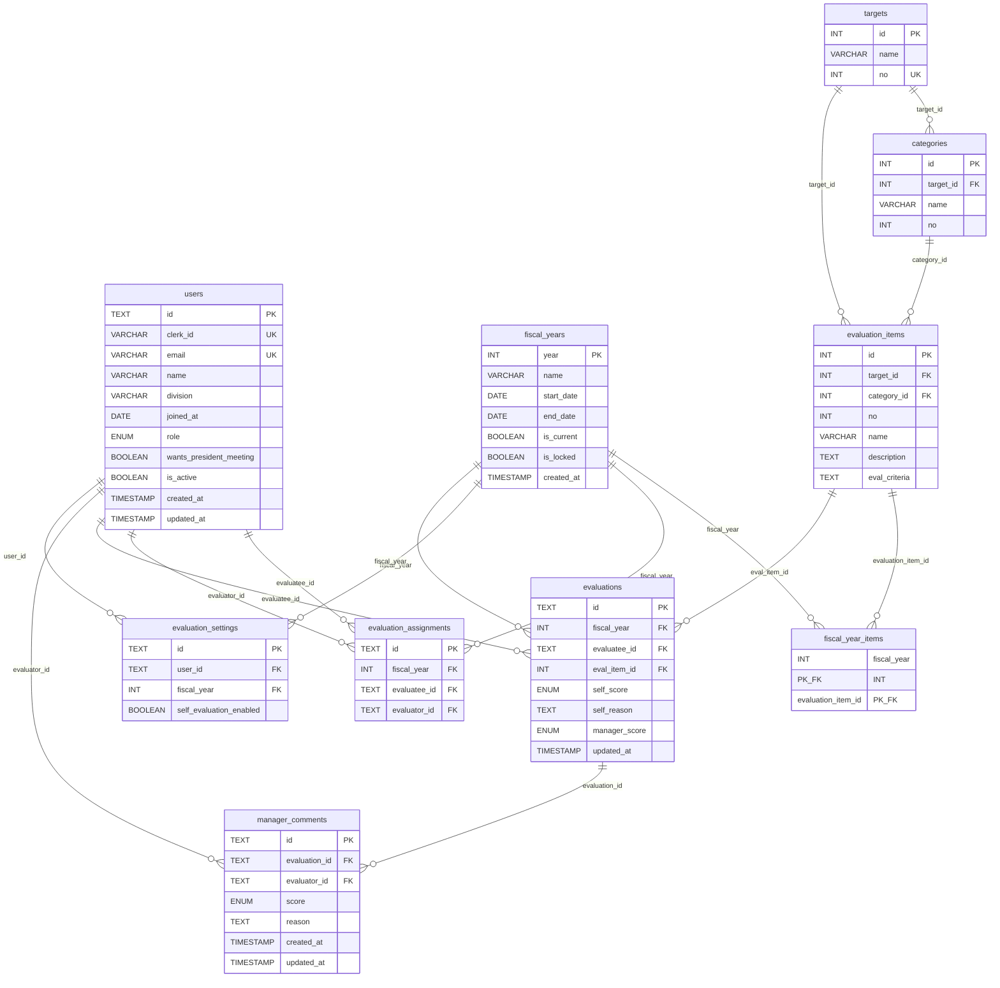

# schema.md — DB スキーマ定義

## PostgreSQL 固有の注意点

- `TEXT[]` は PostgreSQL でそのまま使用可能（配列型）
- `TEXT` は Prisma の `String` 型にマップ。UUID 値は `@default(uuid())` で生成するが DB 上は `TEXT` 型で保存
- `ENUM` は Prisma の `enum` 定義を使用（PostgreSQL の ENUM にマップ）
- 外部キー制約は DB レベルで担保（`relationMode = "prisma"` 不要）

---

## MVP スコープ

MVP では **評価登録機能** に絞る。以下のテーブルのみを対象とする。

| テーブル | 用途 |
|---|---|
| `users` | ユーザー・認証 |
| `fiscal_years` | 年度マスタ |
| `fiscal_year_items` | 年度×評価項目の紐付け（年度ごとに対象項目を制御） |
| `targets` | 評価項目の大分類マスタ |
| `categories` | 評価項目の中分類マスタ |
| `evaluation_items` | 評価項目マスタ |
| `evaluation_assignments` | 年度ごとの評価者アサイン（誰が誰を評価するか） |
| `evaluation_settings` | ユーザー×年度ごとの自己評価要否設定 |
| `evaluations` | 採点レコード（自己評価・最終スコア） |
| `manager_comments` | 評価者コメント（評価者ごとの採点・理由） |

> **defer（v1.1以降）**：roles / role_eval_mappings / role_members / allocations / career_plans / goals / goal_eval_links / monthly_records / assignment_histories

---

## ER 概要

---

## テーブル定義

### users — ユーザー・認証

| カラム | 型 | 制約 | 説明 |
|---|---|---|---|
| id | TEXT | PK, DEFAULT uuid() | UUID 値を TEXT で保存 |
| clerk_id | VARCHAR(255) | UNIQUE | Clerk ユーザーID（初回ログイン時に紐付け） |
| email | VARCHAR(255) | UNIQUE, NOT NULL | ログイン用メール |
| name | VARCHAR(100) | NOT NULL | 氏名 |
| division | VARCHAR(100) | | 所属事業部 |
| joined_at | DATE | | 入社日 |
| role | ENUM | NOT NULL | `ADMIN` / `MEMBER` |
| wants_president_meeting | BOOLEAN | DEFAULT false | 社長面談希望 |
| is_active | BOOLEAN | DEFAULT true | 有効フラグ（false: ログイン不可） |
| created_at | TIMESTAMP | DEFAULT now() | |
| updated_at | TIMESTAMP | | |

> `manager_id` は廃止。評価者/被評価者の関係は `evaluation_assignments` で年度ごとに管理する。

---

### fiscal_years — 年度マスタ

| カラム | 型 | 制約 | 説明 |
|---|---|---|---|
| year | INTEGER | PK | 年度（例: 2025） |
| name | VARCHAR(50) | NOT NULL | 表示名（例: 2025年度） |
| start_date | DATE | NOT NULL | 開始日 |
| end_date | DATE | NOT NULL | 終了日 |
| is_current | BOOLEAN | DEFAULT false | 現在年度フラグ（部分ユニークインデックスで true は最大1件） |
| is_locked | BOOLEAN | DEFAULT false | ロックフラグ（true の場合、評価の作成・編集・削除を一切禁止） |
| created_at | TIMESTAMP | DEFAULT now() | |

---

### fiscal_year_items — 年度×評価項目の紐付け

| カラム | 型 | 制約 | 説明 |
|---|---|---|---|
| fiscal_year | INTEGER | PK, FK → fiscal_years.year | 年度 |
| evaluation_item_id | INTEGER | PK, FK → evaluation_items.id | 評価項目 |

- 年度ごとに対象評価項目を制御する（年度によって評価項目を増減可能）
- 複合主キーで重複防止

---

### targets — 大分類マスタ

| カラム | 型 | 制約 | 説明 |
|---|---|---|---|
| id | INTEGER | PK, AUTOINCREMENT | 大分類ID |
| name | VARCHAR(100) | NOT NULL | 大分類名 |
| no | INTEGER | UNIQUE, NOT NULL | 表示順番号 |

---

### categories — 中分類マスタ

| カラム | 型 | 制約 | 説明 |
|---|---|---|---|
| id | INTEGER | PK, AUTOINCREMENT | 中分類ID |
| target_id | INTEGER | FK → targets.id, NOT NULL | 所属する大分類 |
| name | VARCHAR(100) | NOT NULL | 中分類名 |
| no | INTEGER | NOT NULL | 大分類内での表示順番号 |
| UNIQUE | (target_id, no) | | 大分類内番号の重複防止 |

---

### evaluation_assignments — 年度ごとの評価者アサイン

| カラム | 型 | 制約 | 説明 |
|---|---|---|---|
| id | TEXT | PK, DEFAULT uuid() | UUID 値を TEXT で保存 |
| fiscal_year | INTEGER | NOT NULL | 年度（例: 2025） |
| evaluatee_id | TEXT | FK → users.id | 評価される人 |
| evaluator_id | TEXT | FK → users.id | 評価する人 |
| UNIQUE | (fiscal_year, evaluatee_id, evaluator_id) | | |

- 1人の被評価者に複数の評価者を紐付け可能
- 評価者自身も別の年度・別のアサインで被評価者になれる
- 自己評価はアサイン不要（`evaluatee_id == evaluator_id` として `evaluations` に直接登録）

---

### evaluation_items — 評価項目マスタ

| カラム | 型 | 制約 | 説明 |
|---|---|---|---|
| id | INTEGER | PK, AUTOINCREMENT | 評価項目ID |
| target_id | INTEGER | FK → targets.id, NOT NULL | 大分類 |
| category_id | INTEGER | FK → categories.id, NOT NULL | 中分類 |
| no | INTEGER | NOT NULL | 中分類内での項目番号 |
| name | VARCHAR(255) | NOT NULL | 評価項目名 |
| description | TEXT | | 説明 |
| eval_criteria | TEXT | | 評価事例・基準 |
| UNIQUE | (category_id, no) | | 中分類内番号の重複防止 |

---

### evaluations — 採点レコード

| カラム | 型 | 制約 | 説明 |
|---|---|---|---|
| id | TEXT | PK, DEFAULT uuid() | UUID 値を TEXT で保存 |
| fiscal_year | INTEGER | NOT NULL | 年度 |
| evaluatee_id | TEXT | FK → users.id | 評価される人 |
| eval_item_id | INTEGER | FK → evaluation_items.id | 評価項目 |
| self_score | ENUM | | `none` / `ka` / `ryo` / `yu` |
| self_reason | TEXT | | 自己採点理由 |
| manager_score | ENUM | | 最終評価スコア（アサイン済み評価者・admin が上書き可、nullable） |
| updated_at | TIMESTAMP | NOT NULL, DEFAULT NOW() | 最終更新日時（Prisma @updatedAt） |
| UNIQUE | (fiscal_year, evaluatee_id, eval_item_id) | | 年度×被評価者×項目で1レコード |

- 自己評価（`self_score / self_reason`）は本人が入力
- `manager_score` は評価項目ごとに1つの最終スコア（複数評価者で共有・誰でも上書き可）
- 評価者コメントは `manager_comments` テーブルで別管理（評価者ごとに個別登録）

---

### manager_comments — 評価者コメント

| カラム | 型 | 制約 | 説明 |
|---|---|---|---|
| id | TEXT | PK, DEFAULT uuid() | UUID 値を TEXT で保存 |
| evaluation_id | TEXT | FK → evaluations.id, CASCADE DELETE | 評価レコード |
| evaluator_id | TEXT | FK → users.id | コメントを書いた評価者 |
| score | ENUM | | `none` / `ka` / `ryo` / `yu`（nullable: スコアなしコメントを許容） |
| reason | TEXT | | コメント・採点理由 |
| created_at | TIMESTAMP | NOT NULL, DEFAULT NOW() | 作成日時 |
| updated_at | TIMESTAMP | NOT NULL | 最終更新日時（Prisma @updatedAt） |

- `evaluation_assignments` でアサインされた評価者または admin が登録可能
- 評価者ごとに複数コメントを追加可能（コメントスレッド形式）
- 自分のコメントは編集・削除可能。admin はすべてのコメントを編集・削除可能
- evaluation レコード削除時は CASCADE DELETE

---

### evaluation_settings — 自己評価要否設定

| カラム | 型 | 制約 | 説明 |
|---|---|---|---|
| id | TEXT | PK, DEFAULT uuid() | UUID 値を TEXT で保存 |
| user_id | TEXT | FK → users.id | 対象ユーザー |
| fiscal_year | INTEGER | NOT NULL | 年度（例: 2026） |
| self_evaluation_enabled | BOOLEAN | DEFAULT false | 自己評価の要否（true: 必要 / false: 不要） |
| UNIQUE | (user_id, fiscal_year) | | ユーザー×年度で1レコード |

- 未設定の場合は `self_evaluation_enabled = false`（自己評価なし）として扱う
- admin が年度ごとに設定する

---

## インデックス一覧

| テーブル | 種別 | カラム | 用途 |
|---|---|---|---|
| `users` | UNIQUE | `clerk_id` | Clerk ID による検索・重複防止 |
| `users` | UNIQUE | `email` | メールアドレスによる検索・重複防止 |
| `fiscal_year_items` | PRIMARY KEY（複合） | `(fiscal_year, evaluation_item_id)` | 複合主キー = 重複防止 |
| `evaluation_settings` | UNIQUE（複合） | `(user_id, fiscal_year)` | ユーザー×年度で1レコード |
| `evaluation_assignments` | UNIQUE（複合） | `(fiscal_year, evaluatee_id, evaluator_id)` | 重複アサイン防止 |
| `targets` | UNIQUE | `no` | 全体番号の重複防止 |
| `categories` | UNIQUE（複合） | `(target_id, no)` | 大分類内番号の重複防止 |
| `evaluation_items` | UNIQUE（複合） | `(category_id, no)` | 中分類内番号の重複防止 |
| `evaluations` | UNIQUE（複合） | `(fiscal_year, evaluatee_id, eval_item_id)` | 年度×被評価者×評価項目で1レコード |
| `fiscal_years` | PARTIAL UNIQUE | `is_current = true` | 現在年度フラグは最大1件（マイグレーションで管理） |

---

## スコア値の定義

| 値 | 意味 |
|---|---|
| `none` | なし（未評価） |
| `ka` | 可 |
| `ryo` | 良 |
| `yu` | 優 |

---

## v1.1 以降（defer）

以下のテーブルは v1.1 で追加予定。

| テーブル | 機能 |
|---|---|
| `roles` / `role_eval_mappings` / `role_members` | ロール認定 |
| `allocations` | 事業部別配点 |
| `career_plans` / `goals` / `goal_eval_links` | キャリアプラン・目標管理 |
| `assignment_histories` | 配属履歴 |
| `monthly_records` | 月次実績 |
