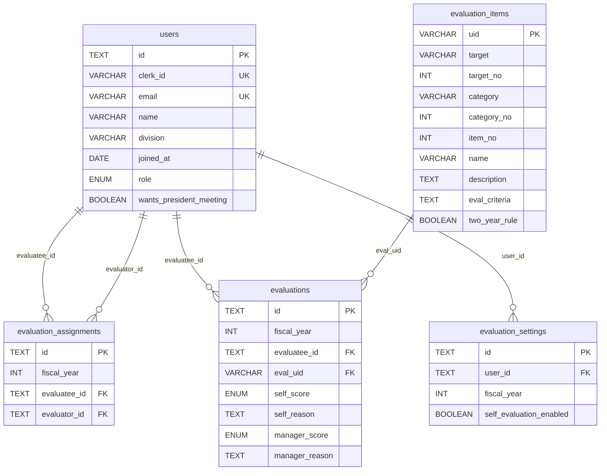

> 最終更新: 2026-03-19 (evaluation_settings テーブル追加)

# schema.md — DB スキーマ定義

## PostgreSQL 固有の注意点

- `TEXT[]` は PostgreSQL でそのまま使用可能（配列型）
- `TEXT` は Prisma の `String` 型にマップ。UUID 値は `@default(uuid())` で生成するが DB 上は `TEXT` 型で保存
- `ENUM` は Prisma の `enum` 定義を使用（PostgreSQL の ENUM にマップ）
- 外部キー制約は DB レベルで担保（`relationMode = "prisma"` 不要）

---

## MVP スコープ

MVP では **評価登録機能** に絞る。以下のテーブルのみを対象とする。

| テーブル | 用途 |
|---|---|
| `users` | ユーザー・認証 |
| `evaluation_assignments` | 年度ごとの評価者アサイン（誰が誰を評価するか） |
| `evaluation_items` | 評価項目マスタ |
| `evaluations` | 採点レコード（自己評価・評価者評価） |
| `evaluation_settings` | ユーザー×年度ごとの自己評価要否設定 |

> **defer（v1.1以降）**：roles / role_eval_mappings / role_members / allocations / career_plans / goals / goal_eval_links / monthly_records / assignment_histories

---

## ER 概要

---

## テーブル定義

### users — ユーザー・認証

| カラム | 型 | 制約 | 説明 |
|---|---|---|---|
| id | TEXT | PK, DEFAULT uuid() | UUID 値を TEXT で保存 |
| clerk_id | VARCHAR(255) | UNIQUE | Clerk ユーザーID（初回ログイン時に紐付け） |
| email | VARCHAR(255) | UNIQUE, NOT NULL | ログイン用メール |
| name | VARCHAR(100) | NOT NULL | 氏名 |
| division | VARCHAR(100) | | 所属事業部 |
| joined_at | DATE | | 入社日 |
| role | ENUM | NOT NULL | `admin` / `member` |
| wants_president_meeting | BOOLEAN | DEFAULT false | 社長面談希望 |
| created_at | TIMESTAMP | DEFAULT now() | |
| updated_at | TIMESTAMP | | |

> `manager_id` は廃止。評価者/被評価者の関係は `evaluation_assignments` で年度ごとに管理する。

---

### evaluation_assignments — 年度ごとの評価者アサイン

| カラム | 型 | 制約 | 説明 |
|---|---|---|---|
| id | TEXT | PK, DEFAULT uuid() | UUID 値を TEXT で保存 |
| fiscal_year | INTEGER | NOT NULL | 年度（例: 2025） |
| evaluatee_id | TEXT | FK → users.id | 評価される人 |
| evaluator_id | TEXT | FK → users.id | 評価する人 |
| UNIQUE | (fiscal_year, evaluatee_id, evaluator_id) | | |

- 1人の被評価者に複数の評価者を紐付け可能
- 評価者自身も別の年度・別のアサインで被評価者になれる
- 自己評価はアサイン不要（`evaluatee_id == evaluator_id` として `evaluations` に直接登録）

---

### evaluation_items — 評価項目マスタ

| カラム | 型 | 制約 | 説明 |
|---|---|---|---|
| uid | VARCHAR(20) | PK | 例: `1-1-1`, `2-3-3` |
| target | VARCHAR(50) | NOT NULL | 大分類（例: employee, projects） |
| target_no | INTEGER | | 大分類番号 |
| category | VARCHAR(100) | NOT NULL | 中分類（例: engagement, programming） |
| category_no | INTEGER | | 中分類番号 |
| item_no | INTEGER | NOT NULL | 項目番号 |
| name | VARCHAR(255) | NOT NULL | 評価項目名 |
| description | TEXT | | 説明 |
| eval_criteria | TEXT | | 評価事例・基準 |
| two_year_rule | BOOLEAN | DEFAULT false | ２年ルール適用 |

---

### evaluations — 採点レコード

| カラム | 型 | 制約 | 説明 |
|---|---|---|---|
| id | TEXT | PK, DEFAULT uuid() | UUID 値を TEXT で保存 |
| fiscal_year | INTEGER | NOT NULL | 年度 |
| evaluatee_id | TEXT | FK → users.id | 評価される人 |
| eval_uid | VARCHAR(20) | FK → evaluation_items.uid | 評価項目 |
| self_score | ENUM | | `none` / `ka` / `ryo` / `yu` |
| self_reason | TEXT | | 自己採点理由 |
| manager_score | ENUM | | `none` / `ka` / `ryo` / `yu`（評価者側がまとめた1つ） |
| manager_reason | TEXT | | 評価者側採点理由 |
| UNIQUE | (fiscal_year, evaluatee_id, eval_uid) | | 年度×被評価者×項目で1レコード |

- 自己評価（`self_score / self_reason`）は本人が入力
- 評価者評価（`manager_score / manager_reason`）は `evaluation_assignments` でアサインされた評価者が入力
- 複数の評価者がいる場合、評価者側で意見をまとめて1つのスコアを登録する

---

### evaluation_settings — 自己評価要否設定

| カラム | 型 | 制約 | 説明 |
|---|---|---|---|
| id | TEXT | PK, DEFAULT uuid() | UUID 値を TEXT で保存 |
| user_id | TEXT | FK → users.id | 対象ユーザー |
| fiscal_year | INTEGER | NOT NULL | 年度（例: 2026） |
| self_evaluation_enabled | BOOLEAN | DEFAULT true | 自己評価の要否（true: 必要 / false: 不要） |
| UNIQUE | (user_id, fiscal_year) | | ユーザー×年度で1レコード |

- 未設定の場合は `self_evaluation_enabled = true`（自己評価あり）として扱う
- admin が年度ごとに設定する

---

## スコア値の定義

| 値 | 意味 |
|---|---|
| `none` | なし（未評価） |
| `ka` | 可 |
| `ryo` | 良 |
| `yu` | 優 |

---

## v1.1 以降（defer）

以下のテーブルは v1.1 で追加予定。

| テーブル | 機能 |
|---|---|
| `roles` / `role_eval_mappings` / `role_members` | ロール認定 |
| `allocations` | 事業部別配点 |
| `career_plans` / `goals` / `goal_eval_links` | キャリアプラン・目標管理 |
| `assignment_histories` | 配属履歴 |
| `monthly_records` | 月次実績 |
