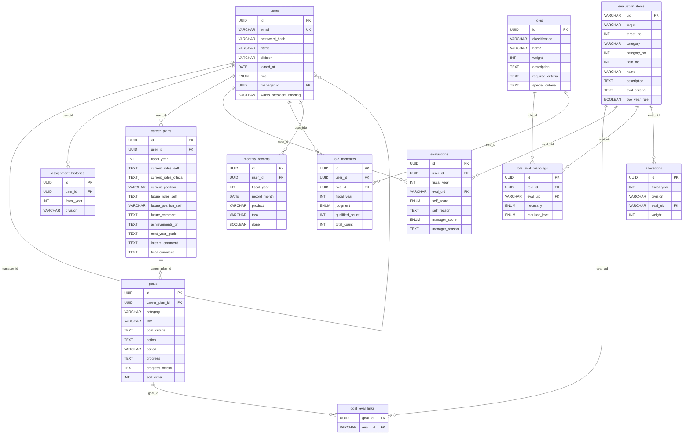

> 最終更新: 2026-03-15 (ER図をMermaid形式で追加)

# schema.md — DB スキーマ定義

## PostgreSQL 固有の注意点

- `TEXT[]` は PostgreSQL でそのまま使用可能（配列型）
- `UUID` は `uuid` 型を使用（`@default(uuid())`）
- `ENUM` は Prisma の `enum` 定義を使用（PostgreSQL の ENUM にマップ）
- 外部キー制約は DB レベルで担保（`relationMode = "prisma"` 不要）

## ER 概要

---

## テーブル定義

### users — 社員・ユーザー

| カラム | 型 | 制約 | 説明 |
|---|---|---|---|
| id | UUID | PK, DEFAULT uuid() | |
| email | VARCHAR(255) | UNIQUE, NOT NULL | ログイン用メール |
| password_hash | VARCHAR(255) | NOT NULL | bcrypt ハッシュ |
| name | VARCHAR(100) | NOT NULL | 氏名 |
| division | VARCHAR(100) | | 所属事業部 |
| joined_at | DATE | | 入社日 |
| role | ENUM | NOT NULL | `admin` / `manager` / `member` |
| manager_id | UUID | FK → users.id | 上長 |
| wants_president_meeting | BOOLEAN | DEFAULT false | 社長面談希望 |
| created_at | TIMESTAMP | DEFAULT now() | |
| updated_at | TIMESTAMP | | |

### assignment_histories — 配属履歴

| カラム | 型 | 制約 | 説明 |
|---|---|---|---|
| id | UUID | PK, DEFAULT uuid() | |
| user_id | UUID | FK → users.id | |
| fiscal_year | INTEGER | NOT NULL | 年度（例: 2025） |
| division | VARCHAR(100) | NOT NULL | 配属事業部 |

### career_plans — 年度別キャリアプラン

| カラム | 型 | 制約 | 説明 |
|---|---|---|---|
| id | UUID | PK, DEFAULT uuid() | |
| user_id | UUID | FK → users.id | |
| fiscal_year | INTEGER | NOT NULL | 年度 |
| current_roles_self | TEXT[] | | 現在ロール（自己認識）例: `["server side engineer"]` |
| current_roles_official | TEXT[] | | 現在ロール（公式） |
| current_position | VARCHAR(50) | | 現在役職 |
| future_roles_self | TEXT[] | | 将来ロール（自己）例: `["Software Architect"]` |
| future_position_self | VARCHAR(50) | | 将来役職（自己） |
| future_comment | TEXT | | 将来への補足コメント |
| achievements_pr | TEXT | | 本年度成果・自由PR |
| next_year_goals | TEXT | | 来年度に向けた目標 |
| interim_comment | TEXT | | 中間面談コメント（上長） |
| final_comment | TEXT | | 期末面談コメント（上長） |
| UNIQUE | (user_id, fiscal_year) | | |

### goals — 年度目標

| カラム | 型 | 制約 | 説明 |
|---|---|---|---|
| id | UUID | PK, DEFAULT uuid() | |
| career_plan_id | UUID | FK → career_plans.id | |
| category | VARCHAR(100) | | 大項目（例: 事業部活動） |
| title | VARCHAR(255) | NOT NULL | 目標タイトル |
| goal_criteria | TEXT | | Goal（達成基準） |
| action | TEXT | | 取り組み内容 |
| period | VARCHAR(50) | | 期間（例: 1Q-3Q） |
| progress | TEXT | | 進捗・結果（本人） |
| progress_official | TEXT | | 進捗・結果（上長補記） |
| sort_order | INTEGER | DEFAULT 0 | 表示順 |

### goal_eval_links — 目標と評価項目の紐付け

| カラム | 型 | 制約 | 説明 |
|---|---|---|---|
| goal_id | UUID | FK → goals.id | |
| eval_uid | VARCHAR(20) | FK → evaluation_items.uid | |
| PRIMARY KEY | (goal_id, eval_uid) | | |

### evaluation_items — 評価項目マスタ

| カラム | 型 | 制約 | 説明 |
|---|---|---|---|
| uid | VARCHAR(20) | PK | 例: `1-1-1`, `2-3-3` |
| target | VARCHAR(50) | NOT NULL | 大分類（例: employee, projects） |
| target_no | INTEGER | | 大分類番号 |
| category | VARCHAR(100) | NOT NULL | 中分類（例: engagement, programming） |
| category_no | INTEGER | | 中分類番号 |
| item_no | INTEGER | NOT NULL | 項目番号 |
| name | VARCHAR(255) | NOT NULL | 評価項目名 |
| description | TEXT | | 説明 |
| eval_criteria | TEXT | | 評価事例・基準 |
| two_year_rule | BOOLEAN | DEFAULT false | ２年ルール適用 |

### evaluations — 年度別採点記録

| カラム | 型 | 制約 | 説明 |
|---|---|---|---|
| id | UUID | PK, DEFAULT uuid() | |
| user_id | UUID | FK → users.id | |
| fiscal_year | INTEGER | NOT NULL | 年度 |
| eval_uid | VARCHAR(20) | FK → evaluation_items.uid | |
| self_score | ENUM | | `none` / `ka` / `ryo` / `yu`（なし/可/良/優） |
| self_reason | TEXT | | 自己採点理由 |
| manager_score | ENUM | | `none` / `ka` / `ryo` / `yu` |
| manager_reason | TEXT | | 上長採点理由 |
| UNIQUE | (user_id, fiscal_year, eval_uid) | | |

### roles — ロール定義

| カラム | 型 | 制約 | 説明 |
|---|---|---|---|
| id | UUID | PK, DEFAULT uuid() | |
| classification | VARCHAR(50) | NOT NULL | 分類（例: engineer, Architect） |
| name | VARCHAR(100) | NOT NULL | ロール名（例: server side engineer） |
| weight | INTEGER | DEFAULT 1 | 重み |
| description | TEXT | | 説明 |
| required_criteria | TEXT | | Required 基準 |
| special_criteria | TEXT | | Special 基準 |
| UNIQUE | (classification, name) | | |

### role_eval_mappings — ロール×評価項目マッピング

| カラム | 型 | 制約 | 説明 |
|---|---|---|---|
| id | UUID | PK, DEFAULT uuid() | |
| role_id | UUID | FK → roles.id | |
| eval_uid | VARCHAR(20) | FK → evaluation_items.uid | |
| necessity | ENUM | NOT NULL | `required`（○）/ `half`（△） |
| required_level | ENUM | NOT NULL | `none` / `ka` / `ryo` / `yu` |

### role_members — 社員のロール認定結果

| カラム | 型 | 制約 | 説明 |
|---|---|---|---|
| id | UUID | PK, DEFAULT uuid() | |
| user_id | UUID | FK → users.id | |
| role_id | UUID | FK → roles.id | |
| fiscal_year | INTEGER | NOT NULL | 年度 |
| judgment | ENUM | NOT NULL | `qualified` / `unqualified` / `none` |
| qualified_count | INTEGER | | 認定項目数 |
| total_count | INTEGER | | 対象項目数 |
| UNIQUE | (user_id, role_id, fiscal_year) | | |

### allocations — 事業部別配点

| カラム | 型 | 制約 | 説明 |
|---|---|---|---|
| id | UUID | PK, DEFAULT uuid() | |
| fiscal_year | INTEGER | NOT NULL | 年度 |
| division | VARCHAR(100) | NOT NULL | 事業部名 |
| eval_uid | VARCHAR(20) | FK → evaluation_items.uid | |
| weight | INTEGER | NOT NULL | 配点 |
| UNIQUE | (fiscal_year, division, eval_uid) | | |

### monthly_records — 月次実績

| カラム | 型 | 制約 | 説明 |
|---|---|---|---|
| id | UUID | PK, DEFAULT uuid() | |
| user_id | UUID | FK → users.id | |
| fiscal_year | INTEGER | NOT NULL | 年度 |
| record_month | DATE | NOT NULL | 対象月（月初日） |
| product | VARCHAR(100) | NOT NULL | プロダクト名 |
| task | VARCHAR(255) | NOT NULL | タスク名 |
| done | BOOLEAN | DEFAULT false | 実施済みフラグ |
| UNIQUE | (user_id, record_month, product, task) | | |
