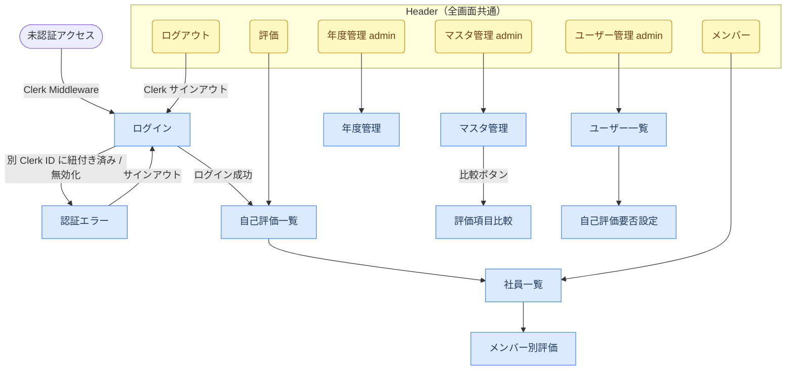

# ui.md — UI設計書

## 画面一覧・遷移

### 画面一覧

| 画面 | パス | レイアウト | アクセス制限 |
|------|------|-----------|------------|
| ログイン | `/login` | ヘッダーなし | 未認証のみ |
| 認証エラー | `/auth-error` | ヘッダーなし | なし |
| 自己評価一覧 | `/evaluations` | ヘッダーあり | 要ログイン |
| 社員一覧 | `/members` | ヘッダーあり | 要ログイン |
| メンバー別評価 | `/members/[id]/evaluations` | ヘッダーあり | 要ログイン |
| 管理：マスタ管理 | `/admin/targets` | ヘッダーあり | admin のみ |
| 管理：バージョン詳細 | `/admin/targets/versions/[id]` | ヘッダーあり | admin のみ |
| 管理：評価項目比較 | `/admin/targets/compare` | ヘッダーあり | admin のみ |
| 管理：評価項目マスタ（リダイレクト） | `/admin/evaluation-items` | — | → `/admin/targets` |
| 管理：年度管理 | `/admin/fiscal-years` | ヘッダーあり | admin のみ |
| 管理：ユーザー一覧 | `/admin/users` | ヘッダーあり | admin のみ |
| 管理：自己評価要否設定 | `/admin/users/[id]/evaluation-settings` | ヘッダーあり | admin のみ |
| 管理：評価者アサイン管理 | `/admin/evaluation-assignments` | ヘッダーあり | admin のみ |
| 管理：評価一覧 | `/admin/evaluations` | ヘッダーあり | admin のみ |
| 管理：評価進捗ダッシュボード | `/admin/progress` | ヘッダーあり | admin のみ |

### 画面遷移



---

## 機能要件

### 1. ユーザー・認証

- Clerk によるメールアドレス + パスワード認証
- ロールは `ADMIN` / `MEMBER` の2種類
  - `ADMIN`：ユーザー管理・マスタデータ管理が可能
  - `MEMBER`：評価者/被評価者どちらにもなれる（ロールではなく `evaluation_assignments` で制御）
- `MEMBER` は自分が被評価者のデータのみ自己評価を入力できる
- `evaluation_assignments` でアサインされた評価者は、担当する被評価者の評価者評価を入力できる
- `ADMIN` はすべてのデータを操作できる

#### ユーザーの削除・無効化

| 操作 | 条件 | 挙動 |
|---|---|---|
| **削除** | 評価データ・アサインデータが一切ない場合のみ可 | DB からレコードを物理削除 |
| **無効化** | 常に可（関連データの有無に関わらず） | `is_active: false` を設定。ログイン不可になるがデータは保持 |
| **有効化** | 無効化済みユーザーのみ | `is_active: true` に戻す |

- 無効化ユーザーはログイン時に `getSession()` が `null` を返し `/auth-error` へリダイレクト（Clerk セッションは残っているため `/login` ではなく `/auth-error`）
- 無効化ユーザーはユーザー管理画面でグレーアウト表示
- 社員一覧・評価アサイン等では無効化ユーザーを非表示にする
- **無効化**：退職・休職など、評価データを残しつつアクセスを停止したい場合
- **削除**：テストユーザーなど、関連データが一切ない不要なユーザーの完全除去

### 2. 評価者アサイン管理

- 年度ごとに「誰が誰を評価するか」を登録できる
- 1人の被評価者に複数の評価者を紐付けられる
- 評価者自身も別のアサインで被評価者になれる
- アサインは ADMIN が管理する

### 3. 評価項目マスタ

- 評価項目は UID（例: `1-1-1`）で一意に識別される
- 評価項目の構造：大分類（target）> 中分類（category）> 項目番号
- 各項目に説明・評価基準・２年ルールフラグを持つ
- マスタデータはシードで投入し、MVP では画面管理は行わない

### 4. 評価登録

- 評価は年度単位で管理される
- 被評価者 × 年度 × 評価項目 で1レコード
- 本人が入力できる項目：自己採点（なし / 可 / 良 / 優）・自己採点理由（テキスト）
- 評価者が入力できる項目：評価者採点（なし / 可 / 良 / 優）・評価者採点理由（テキスト）
- 複数の評価者がいる場合は評価者側で意見をまとめて1つのスコアを登録する
- 自己評価は必ず行う

#### 評価者コメント管理

- アサインされた評価者は対象被評価者の評価ページにコメントを追加できる
- 自分が投稿したコメントのみ編集・削除できる
- **ADMIN はすべてのユーザーのコメントを編集・削除できる**（投稿者に関わらず）

### 5. 年度ロック

- ADMIN は年度をロック（`is_locked = true`）できる
- ロックされた年度は自己評価・評価者評価の入力が一括で禁止される（閲覧のみ可能）
- ADMIN はロックを解除して再び編集可能な状態に戻せる

---

## 画面機能仕様

### ログイン（`/login`）

Clerk の SignIn UI を表示する。メールアドレス＋パスワードで認証し、成功後は自己評価一覧へ遷移する。

### 認証エラー（`/auth-error`）

アカウントが別の Clerk ID に紐付き済みの場合、または無効化されたユーザーがログインした場合に表示する。サインアウトボタンのみ提供し、ログイン画面へ誘導する。

### 自己評価一覧（`/evaluations`）

ログインユーザー本人の評価項目一覧を表示し、自己評価を入力・保存できる。

| 機能 | 説明 |
|------|------|
| タブ切り替え | 中分類ごとにタブで切り替え |
| 評価項目カード | UID・項目名・説明・評価基準を表示 |
| 自己採点 | なし / 可 / 良 / 優 のボタン選択。選択中は青ハイライト |
| 自己採点理由 | テキストエリアで入力 |
| 保存ボタン | 項目ごとに個別保存。保存中は「保存中...」表示、成功後2秒間「保存しました」表示 |
| 空状態 | 評価項目がない場合は「評価項目がありません。」を表示 |

`self_evaluation_enabled = false` の場合、自己評価入力フォームを非表示にする。

対象年度が **ロック済み**（`is_locked = true`）の場合、画面上部に「🔒 この年度はロック済みです。閲覧のみ可能です。」バナーを表示し、入力 UI（採点ボタン・テキストエリア・保存ボタン）を非表示にして閲覧専用モードに切り替える。

### 社員一覧（`/members`）

対象年度の被評価者一覧を表示する。現在年度（`fiscal_years.is_current = true`）が未設定の場合は `/evaluations` にリダイレクトする。

| 機能 | 説明 |
|------|------|
| メンバー一覧 | 対象年度の被評価者の氏名・所属部署を表示 |
| 評価リンク | アクセス者の役割に応じてリンク種別を切り替える（後述） |

### メンバー別評価（`/members/[id]/evaluations`）

指定メンバーへの評価者評価を入力・保存できる。

| 機能 | 説明 |
|------|------|
| タブ切り替え | 中分類ごとにタブで切り替え |
| 評価項目カード | UID・項目名・説明・評価基準を表示 |
| 評価者採点 | なし / 可 / 良 / 優 のボタン選択 |
| 評価者採点理由 | テキストエリアで入力 |
| 保存ボタン | 項目ごとに個別保存 |

アクセス制御：要ログイン。評価は過去も含めてオープンで、ログイン済みであれば誰でも閲覧可能。以下の「リンク（一覧）」は、一覧に表示されたメンバーに対して、アクセス者の役割に応じて切り替わる。

| 条件 | リンク（一覧） | ページモード |
|------|-------------|------------|
| 年度ロック済み（全員） | 参照 → | 読み取り専用 |
| 自分自身 | 自己評価 → | 読み取り専用（自己評価ページへ） |
| 担当の被評価者（アサイン済み） | 評価入力 → | 編集可能 |
| 担当外の被評価者 | 参照 → | 読み取り専用 |

当該年度に被評価者として登録されていないユーザーの URL に直接アクセスした場合は 404 を返す。

#### 評価者コメント

評価ページのコメントスレッドは以下のルールで編集・削除ボタンを表示する。

| ロール | 自分のコメント | 他者のコメント |
|--------|-------------|-------------|
| MEMBER（評価者） | 編集・削除ボタンを表示 | ボタン非表示 |
| ADMIN | 編集・削除ボタンを表示 | **編集・削除ボタンを表示**（全コメント管理可） |

対象年度が **ロック済み**（`is_locked = true`）の場合、画面上部に「🔒 この年度はロック済みです。閲覧のみ可能です。」バナーを表示し、採点ボタン・保存ボタン・コメント追加／編集／削除ボタンをすべて非表示にして閲覧専用モードに切り替える。

### 管理：マスタ管理（`/admin/targets`）

大分類・中分類・評価項目の一覧表示・追加・編集・削除・並び替え、およびバージョン管理を行う。

| 機能 | 説明 |
|------|------|
| 大分類・中分類・評価項目管理 | 3 階層アコーディオンで表示。追加・編集・削除・ドラッグ＆ドロップ並び替え |
| バージョン保存 | 現在の作業スペース（大分類・中分類・評価項目）をスナップショットとして保存 |
| バージョン一覧 | 保存済みバージョンの名前・作成日時・評価項目数・年度割り当て数を表示 |
| バージョン復元 | バージョンから作業スペースを完全復元（全消し→insert） |
| バージョン削除 | 年度に割り当て中のバージョンは削除不可（ボタン disabled） |

### 管理：年度管理（`/admin/fiscal-years`）

年度の一覧表示・追加・編集・削除・現在年度設定・ロック設定を行う。関連データがある年度は削除不可。

| 機能 | 説明 |
|------|------|
| 年度一覧 | 年度名・期間・現在年度フラグ・ロック状態を表示 |
| 現在年度設定 | `is_current = true` は常に1件のみ |
| ロック/解除 | ADMIN が年度をロック（`is_locked = true`）すると、その年度の評価編集を一括禁止。解除も可能 |
| バージョン割り当て | 年度ごとにバージョンを割り当て・解除するドロップダウン。ロック済み年度は変更不可 |

### 管理：ユーザー一覧（`/admin/users`）

全ユーザーの一覧を表示し、ロール変更・有効化/無効化・削除を操作できる。

| 表示項目 | 説明 |
|---------|------|
| 名前・メール | ユーザー情報 |
| ロール | `admin` / `member`。変更ボタンで切り替え |
| 有効フラグ | 無効化ユーザーはグレーアウト表示 |
| 操作 | ロール変更・有効化/無効化・削除（自分自身への操作は不可） |

削除は確認ダイアログを表示。関連データがある場合は削除不可（エラー表示）。

### 管理：自己評価要否設定（`/admin/users/[id]/evaluation-settings`）

指定ユーザーの年度別自己評価要否（`self_evaluation_enabled`）をトグルで切り替える。

### 管理：評価進捗ダッシュボード（`/admin/progress`）

全被評価者の評価入力状況を年度別に一覧表示する。ADMIN のみ閲覧可能。

| 表示項目 | 説明 |
|---------|------|
| 社員名 | 被評価者の氏名 |
| 自己評価 進捗 | 入力済み件数 / 全件数（%）。`self_score != null` のレコード数でカウント |
| 上長評価 進捗 | 入力済み件数 / 全件数（%）。`manager_score != null` のレコード数でカウント |
| 最終更新日 | その被評価者の評価レコードの最新 `updated_at`。レコードなしの場合は「—」 |

フィルター：年度セレクトボックス（`AdminYearSelector`）。デフォルトは現在年度。進捗率は 100% で緑・1〜99% で黄・0% でグレー表示。

### 管理：評価一覧（`/admin/evaluations`）

全社員の評価をマトリクス形式で一覧表示する。

| 表示項目 | 説明 |
|---------|------|
| 縦軸: UID | 評価項目の一意識別子（例: `1-1-1`） |
| 縦軸: 評価項目名 | 評価項目名称 |
| 横軸: 社員名 | アクティブユーザー全員 |
| セル: 採点値 | なし / 可 / 良 / 優（未入力は `-` と表示） |

- フィルター：年度セレクトボックス（`AdminYearSelector`）。デフォルトは現在年度
- トグル：「自己採点」「上長採点」「両方」の 3 モードをクライアントサイドで切り替え（デフォルト: 自己採点）。「両方」選択時はセルに `自己 / 上長` の `/` 区切りで表示
- 旧 URL（`/admin/self-evaluations`、`/admin/manager-evaluations`）は `/admin/evaluations` にリダイレクト

---

## 各画面の表示状態

### 自己評価一覧（`/evaluations`）

| 状態 | 条件 | 表示 |
|------|------|------|
| Loading | データ取得中 | ページ全体スケルトン（`animate-pulse`） |
| Empty | 有効な評価項目が 0 件 | 「評価項目がありません。」（`text-gray-500`） |
| Error | API エラー / 権限なし | エラーメッセージ（`text-red-600`）、データは非表示 |

### 社員一覧（`/members`）

| 状態 | 条件 | 表示 |
|------|------|------|
| Loading | データ取得中 | ページ全体スケルトン |
| Empty | 有効なメンバーが 0 件 | 「メンバーがいません。」（`text-gray-500`） |
| Error | API エラー | エラーメッセージ（`text-red-600`） |

### メンバー別評価（`/members/[id]/evaluations`）

| 状態 | 条件 | 表示 |
|------|------|------|
| Loading | データ取得中 | ページ全体スケルトン |
| Empty | 評価項目が 0 件 | 「評価項目がありません。」（`text-gray-500`） |
| Error | API エラー / アクセス権限なし | エラーメッセージ（`text-red-600`） |
| SaveError | 採点保存失敗 | ボタン下部にインラインエラー（`text-sm text-red-600`） |

### 管理：マスタ管理（`/admin/targets`）

| 状態 | 条件 | 表示 |
|------|------|------|
| Loading | データ取得中 | テーブルスケルトン |
| Empty | 大分類が 0 件 | 「大分類が登録されていません。」（`text-gray-500`） |
| Error | 削除時に中分類が紐づいている | フォーム上部エラーメッセージ（`text-red-600`） |

### 管理：年度管理（`/admin/fiscal-years`）

| 状態 | 条件 | 表示 |
|------|------|------|
| Loading | データ取得中 | テーブルスケルトン |
| Empty | 年度が 0 件 | 「年度がありません。」（`text-gray-500`） |
| Error | 削除時に関連データが存在する | フォーム上部エラーメッセージ（`text-red-600`） |
| Locked | 対象年度がロック済み | 黄色バナー「🔒 この年度はロック済みです。閲覧のみ可能です。」を表示し、入力 UI を非表示 |

### 管理：ユーザー一覧（`/admin/users`）

| 状態 | 条件 | 表示 |
|------|------|------|
| Loading | データ取得中 | テーブルスケルトン |
| Empty | ユーザーが 0 件 | 「ユーザーがいません。」（`text-gray-500`） |
| Error | 削除時に関連データが存在する / 自分自身の削除 | フォーム上部エラーメッセージ（`text-red-600`） |

### 管理：自己評価要否設定（`/admin/users/[id]/evaluation-settings`）

| 状態 | 条件 | 表示 |
|------|------|------|
| Loading | データ取得中 | テーブルスケルトン |
| Empty | 年度が 0 件 | 「設定可能な年度がありません。」（`text-gray-500`） |
| Error | API エラー | エラーメッセージ（`text-red-600`） |

### 管理：評価進捗ダッシュボード（`/admin/progress`）

| 状態 | 条件 | 表示 |
|------|------|------|
| Empty（年度未選択） | 年度が 1 件も登録されていない | 「年度を選択してください。」（テーブル内中央） |
| Empty（データなし） | 対象年度にアサインされた被評価者が 0 件 | 「評価データがありません。」（テーブル内中央、`text-gray-500`） |

### 管理：評価一覧（`/admin/evaluations`）

| 状態 | 条件 | 表示 |
|------|------|------|
| Empty（年度未選択） | 年度が 1 件も登録されていない | 「年度を選択してください。」（中央、`text-gray-500`） |
| Empty（データなし） | ユーザーまたは評価項目が 0 件 | 「評価データがありません。」（中央、`text-gray-500`） |

---

## UI 規約

### ページ構造の共通パターン

```tsx
// ダッシュボードレイアウト全体
<div className="min-h-screen bg-gray-50">
  <header className="border-b bg-white px-6 py-4">
    <div className="mx-auto flex max-w-5xl items-center justify-between">
      ...
    </div>
  </header>
  <main className="mx-auto max-w-5xl px-6 py-8">
    {children}
  </main>
</div>
```

### ボタン

shadcn/ui ベースの `Button` コンポーネント（`src/components/ui/button.tsx`）を使用する。

| variant | 用途 |
|---------|------|
| `default` | 保存・作成などの主要アクション |
| `outline` | キャンセル・編集などの補助アクション |
| `secondary` | 二次的なアクション |
| `destructive` | 削除・無効化などの破壊的操作 |

管理画面のインライン操作ボタン（ロール変更・有効化/無効化・削除）は `<button>` 直書きで `text-xs` サイズを使用。

### フォーム入力

```tsx
// 通常状態
className="rounded-md border border-gray-300 px-3 py-2 text-sm focus:border-blue-500 focus:outline-none focus:ring-1 focus:ring-blue-500"

// エラー状態（バリデーション失敗時）
className="... border-red-500"
```

### フィードバックパターン

| 状態 | 表示方法 |
|------|---------|
| エラー | `<span className="text-sm text-red-600">...</span>` |
| 送信中 | ボタンテキスト変更（例: `"保存中..."`) + `disabled` |
| 保存成功 | テキスト一時表示（例: 「保存しました」、2秒後に非表示） |
| 空状態 | `<p className="text-gray-500">〇〇がありません。</p>` |

### 採点ボタン

自己評価・評価者評価の採点選択には専用のボタン UI を使用する。

```tsx
// 選択中
className="rounded-md px-3 py-1.5 text-sm font-medium bg-blue-600 text-white"

// 未選択
className="rounded-md px-3 py-1.5 text-sm font-medium border border-gray-300 text-gray-700 hover:bg-gray-50"
```
