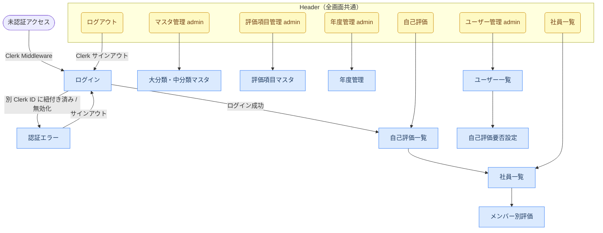

> 最終更新: 2026-03-26 (各画面の表示状態セクションを追加)

# ui.md — UI設計書

## 画面一覧・遷移

### 画面一覧

| 画面 | パス | レイアウト | アクセス制限 |
|------|------|-----------|------------|
| ログイン | `/login` | ヘッダーなし | 未認証のみ |
| 認証エラー | `/auth-error` | ヘッダーなし | なし |
| 自己評価一覧 | `/evaluations` | ヘッダーあり | 要ログイン |
| 社員一覧 | `/members` | ヘッダーあり | 要ログイン |
| メンバー別評価 | `/members/[id]/evaluations` | ヘッダーあり | 要ログイン（アサイン済み評価者 / admin） |
| 管理：大分類・中分類マスタ | `/admin/targets` | ヘッダーあり | admin のみ |
| 管理：評価項目マスタ | `/admin/evaluation-items` | ヘッダーあり | admin のみ |
| 管理：年度管理 | `/admin/fiscal-years` | ヘッダーあり | admin のみ |
| 管理：ユーザー一覧 | `/admin/users` | ヘッダーあり | admin のみ |
| 管理：自己評価要否設定 | `/admin/users/[id]/evaluation-settings` | ヘッダーあり | admin のみ |

### 画面遷移



---

## 画面機能仕様

### ログイン（`/login`）

Clerk の SignIn UI を表示する。メールアドレス＋パスワードで認証し、成功後は自己評価一覧へ遷移する。

### 認証エラー（`/auth-error`）

アカウントが別の Clerk ID に紐付き済みの場合、または無効化されたユーザーがログインした場合に表示する。サインアウトボタンのみ提供し、ログイン画面へ誘導する。

### 自己評価一覧（`/evaluations`）

ログインユーザー本人の評価項目一覧を表示し、自己評価を入力・保存できる。

| 機能 | 説明 |
|------|------|
| タブ切り替え | 中分類ごとにタブで切り替え |
| 評価項目カード | UID・項目名・説明・評価基準を表示 |
| 自己採点 | なし / 可 / 良 / 優 のボタン選択。選択中は青ハイライト |
| 自己採点理由 | テキストエリアで入力 |
| 保存ボタン | 項目ごとに個別保存。保存中は「保存中...」表示、成功後2秒間「保存しました」表示 |
| 空状態 | 評価項目がない場合は「評価項目がありません。」を表示 |

`self_evaluation_enabled = false` の場合、自己評価入力フォームを非表示にする。

### 社員一覧（`/members`）

全メンバー（`is_active = true`）の一覧を表示する。現在年度（`fiscal_years.is_current = true`）が未設定の場合は `/evaluations` にリダイレクトする。

| 機能 | 説明 |
|------|------|
| メンバー一覧 | 氏名・所属部署を表示 |
| 評価リンク | 自分がアサインされている被評価者、または admin は全員へのリンクを表示 |

### メンバー別評価（`/members/[id]/evaluations`）

指定メンバーへの評価者評価を入力・保存できる。

| 機能 | 説明 |
|------|------|
| タブ切り替え | 中分類ごとにタブで切り替え |
| 評価項目カード | UID・項目名・説明・評価基準を表示 |
| 評価者採点 | なし / 可 / 良 / 優 のボタン選択 |
| 評価者採点理由 | テキストエリアで入力 |
| 保存ボタン | 項目ごとに個別保存 |

アクセス制御：`evaluation_assignments` でアサインされた評価者または admin のみ（サーバー側で検証）。

### 管理：大分類・中分類マスタ（`/admin/targets`）

大分類の一覧表示・追加・編集・削除を行う。中分類が紐づいている場合は削除不可（エラー表示）。

### 管理：評価項目マスタ（`/admin/evaluation-items`）

評価項目の一覧表示・追加・編集・削除を行う。大分類・中分類を選択して登録する。

### 管理：年度管理（`/admin/fiscal-years`）

年度の一覧表示・追加・編集・削除・現在年度設定を行う。関連データがある年度は削除不可。

| 機能 | 説明 |
|------|------|
| 年度一覧 | 年度名・期間・現在年度フラグを表示 |
| 現在年度設定 | `is_current = true` は常に1件のみ |
| 有効評価項目管理 | 年度ごとに有効な評価項目を追加・削除 |

### 管理：ユーザー一覧（`/admin/users`）

全ユーザーの一覧を表示し、ロール変更・有効化/無効化・削除を操作できる。

| 表示項目 | 説明 |
|---------|------|
| 名前・メール | ユーザー情報 |
| ロール | `admin` / `member`。変更ボタンで切り替え |
| 有効フラグ | 無効化ユーザーはグレーアウト表示 |
| 操作 | ロール変更・有効化/無効化・削除（自分自身への操作は不可） |

削除は確認ダイアログを表示。関連データがある場合は削除不可（エラー表示）。

### 管理：自己評価要否設定（`/admin/users/[id]/evaluation-settings`）

指定ユーザーの年度別自己評価要否（`self_evaluation_enabled`）をトグルで切り替える。

---

## 各画面の表示状態

### 自己評価一覧（`/evaluations`）

| 状態 | 条件 | 表示 |
|------|------|------|
| Loading | データ取得中 | ページ全体スケルトン（`animate-pulse`） |
| Empty | 有効な評価項目が 0 件 | 「評価項目がありません。」（`text-gray-500`） |
| Error | API エラー / 権限なし | エラーメッセージ（`text-red-600`）、データは非表示 |

### 社員一覧（`/members`）

| 状態 | 条件 | 表示 |
|------|------|------|
| Loading | データ取得中 | ページ全体スケルトン |
| Empty | 有効なメンバーが 0 件 | 「メンバーがいません。」（`text-gray-500`） |
| Error | API エラー | エラーメッセージ（`text-red-600`） |

### メンバー別評価（`/members/[id]/evaluations`）

| 状態 | 条件 | 表示 |
|------|------|------|
| Loading | データ取得中 | ページ全体スケルトン |
| Empty | 評価項目が 0 件 | 「評価項目がありません。」（`text-gray-500`） |
| Error | API エラー / アクセス権限なし | エラーメッセージ（`text-red-600`） |
| SaveError | 採点保存失敗 | ボタン下部にインラインエラー（`text-sm text-red-600`） |

### 管理：大分類・中分類マスタ（`/admin/targets`）

| 状態 | 条件 | 表示 |
|------|------|------|
| Loading | データ取得中 | テーブルスケルトン |
| Empty | 大分類が 0 件 | 「大分類がありません。」（`text-gray-500`） |
| Error | 削除時に中分類が紐づいている | フォーム上部エラーメッセージ（`text-red-600`） |

### 管理：評価項目マスタ（`/admin/evaluation-items`）

| 状態 | 条件 | 表示 |
|------|------|------|
| Loading | データ取得中 | テーブルスケルトン |
| Empty | 評価項目が 0 件 | 「評価項目がありません。」（`text-gray-500`） |
| Error | 削除時に年度に紐づいている | フォーム上部エラーメッセージ（`text-red-600`） |

### 管理：年度管理（`/admin/fiscal-years`）

| 状態 | 条件 | 表示 |
|------|------|------|
| Loading | データ取得中 | テーブルスケルトン |
| Empty | 年度が 0 件 | 「年度がありません。」（`text-gray-500`） |
| Error | 削除時に関連データが存在する | フォーム上部エラーメッセージ（`text-red-600`） |

### 管理：ユーザー一覧（`/admin/users`）

| 状態 | 条件 | 表示 |
|------|------|------|
| Loading | データ取得中 | テーブルスケルトン |
| Empty | ユーザーが 0 件 | 「ユーザーがいません。」（`text-gray-500`） |
| Error | 削除時に関連データが存在する / 自分自身の削除 | フォーム上部エラーメッセージ（`text-red-600`） |

### 管理：自己評価要否設定（`/admin/users/[id]/evaluation-settings`）

| 状態 | 条件 | 表示 |
|------|------|------|
| Loading | データ取得中 | テーブルスケルトン |
| Empty | 年度が 0 件 | 「設定可能な年度がありません。」（`text-gray-500`） |
| Error | API エラー | エラーメッセージ（`text-red-600`） |

---

## レイアウト構成

### layout.tsx 階層

```
src/app/layout.tsx（RootLayout）
  ClerkProvider
  └─ html[lang="ja"]
       └─ body
            ├─ src/app/(auth)/login/[[...rest]]/page.tsx   ヘッダーなし
            ├─ src/app/auth-error/page.tsx                  ヘッダーなし
            └─ src/app/(dashboard)/layout.tsx（DashboardLayout）
                 Header（NavLinks + SignOutButton）
                 └─ /evaluations
                 └─ /members/*
                 └─ /admin/*
```

### ページ幅

| 幅クラス | 使用箇所 |
|---------|---------|
| `max-w-5xl` | ヘッダー内コンテンツ、全ダッシュボードページのメインコンテンツ |

---

## コンポーネント一覧

### 共通コンポーネント（`src/components/`）

| コンポーネント | 種別 | 用途 | 使用箇所 |
|--------------|------|------|---------|
| `NavLinks` | Client Component | ロールに応じたナビゲーションリンク。member は自己評価・社員一覧、admin はさらに管理メニューを表示 | DashboardLayout |
| `SignOutButton` | Clerk 提供 | ログアウト処理。`redirectUrl="/login"` を指定 | DashboardLayout |
| `ui/Button` | Client Component | 共通ボタン（variant: default / outline / secondary / destructive 等） | 全画面 |

### ページ内コンポーネント（`src/components/evaluation/`）

| コンポーネント | 種別 | 用途 |
|--------------|------|------|
| `EvaluationTabs` | Client Component | 自己評価入力。中分類タブ・採点ボタン・理由テキストエリア・個別保存 |
| `ManagerEvaluationTabs` | Client Component | 評価者評価入力。構成は EvaluationTabs と同様 |

### ページ内コンポーネント（`src/components/admin/`）

| コンポーネント | 種別 | 用途 |
|--------------|------|------|
| `TargetForm` | Client Component | 大分類の追加・編集フォーム |
| `TargetActions` | Client Component | 大分類の編集・削除ボタン |
| `CategoryForm` | Client Component | 中分類の追加・編集フォーム |
| `CategoryActions` | Client Component | 中分類の編集・削除ボタン |
| `EvaluationItemForm` | Client Component | 評価項目の追加・編集フォーム |
| `EvaluationItemActions` | Client Component | 評価項目の編集・削除ボタン |
| `FiscalYearForm` | Client Component | 年度の追加・編集フォーム |
| `FiscalYearActions` | Client Component | 年度の編集・削除・現在年度設定ボタン |
| `UserActions` | Client Component | ユーザーのロール変更・有効化/無効化・削除ボタン |
| `EvaluationSettingToggle` | Client Component | 自己評価要否のトグルスイッチ |

---

## UI 規約

### ページ構造の共通パターン

```tsx
// ダッシュボードレイアウト全体
<div className="min-h-screen bg-gray-50">
  <header className="border-b bg-white px-6 py-4">
    <div className="mx-auto flex max-w-5xl items-center justify-between">
      ...
    </div>
  </header>
  <main className="mx-auto max-w-5xl px-6 py-8">
    {children}
  </main>
</div>
```

### ボタン

shadcn/ui ベースの `Button` コンポーネント（`src/components/ui/button.tsx`）を使用する。

| variant | 用途 |
|---------|------|
| `default` | 保存・作成などの主要アクション |
| `outline` | キャンセル・編集などの補助アクション |
| `secondary` | 二次的なアクション |
| `destructive` | 削除・無効化などの破壊的操作 |

管理画面のインライン操作ボタン（ロール変更・有効化/無効化・削除）は `<button>` 直書きで `text-xs` サイズを使用。

### フォーム入力

```tsx
// 通常状態
className="rounded-md border border-gray-300 px-3 py-2 text-sm focus:border-blue-500 focus:outline-none focus:ring-1 focus:ring-blue-500"

// エラー状態（バリデーション失敗時）
className="... border-red-500"
```

### フィードバックパターン

| 状態 | 表示方法 |
|------|---------|
| エラー | `<span className="text-sm text-red-600">...</span>` |
| 送信中 | ボタンテキスト変更（例: `"保存中..."`) + `disabled` |
| 保存成功 | テキスト一時表示（例: 「保存しました」、2秒後に非表示） |
| 空状態 | `<p className="text-gray-500">〇〇がありません。</p>` |

### 採点ボタン

自己評価・評価者評価の採点選択には専用のボタン UI を使用する。

```tsx
// 選択中
className="rounded-md px-3 py-1.5 text-sm font-medium bg-blue-600 text-white"

// 未選択
className="rounded-md px-3 py-1.5 text-sm font-medium border border-gray-300 text-gray-700 hover:bg-gray-50"
```
